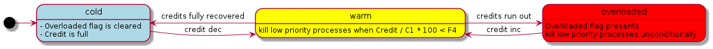
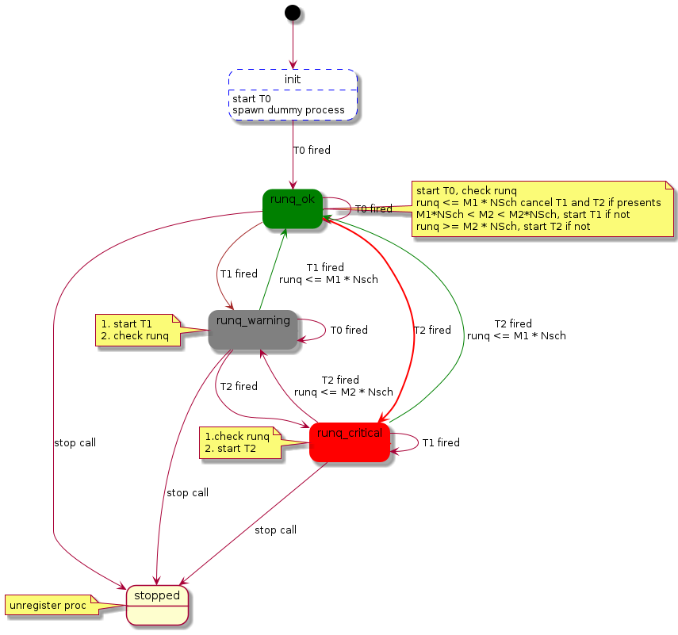

# flagman

## Overall

**flagman** is a long-living, supervised process which only monitors the system [runq](#orgf1c7288) and ensures [actions](#org46d8621) are taken when conditions are met.

By design, the process runs as high priority and avoids communicating with other processes.

## Terminology

<table border="2" cellspacing="0" cellpadding="6" rules="groups" frame="hsides">

<colgroup>
<col  class="org-left" />

<col  class="org-left" />
</colgroup>
<thead>
<tr>
<th scope="col" class="org-left">Term</th>
<th scope="col" class="org-left">Definition</th>
</tr>
</thead>

<tbody>
<tr>
<td class="org-left">Runq</td>
<td class="org-left">The length of beam system run_queue, checked periodly, see <a href="#org7afe759">T1</a> and <a href="#orgc6b8210">T2</a>.</td>
</tr>

<tr>
<td class="org-left">Scheduler</td>
<td class="org-left">Number of <b>Online</b> schedulers.</td>
</tr>

<tr>
<td class="org-left">Credits</td>
<td class="org-left">Gain credits when <a href="#orgf1c7288">runq</a> is under limit, lose credits when <a href="#orgf1c7288">runq</a> is over limit.</td>
</tr>

<tr>
<td class="org-left">Priority Group</td>
<td class="org-left">Process could join/leave prioriy groups. Load contol takes different actions when conditions are meet.</td>
</tr>

<tr>
<td class="org-left">Overloaded</td>
<td class="org-left">State when <a href="#org27a7d34">credits</a> runs out. System is overloaded and action must be taken.</td>
</tr>

<tr>
<td class="org-left">Warm</td>
<td class="org-left">State when system is losing/gaining <a href="#org27a7d34">credits</a>, a middle state preventing system is shifting between <a href="#orge30a1df">cold</a> and <a href="#orgcd88e5c">overloaded</a></td>
</tr>

<tr>
<td class="org-left">Cold</td>
<td class="org-left">State when system is full of <a href="#org27a7d34">credits</a></td>
</tr>

<tr>
<td class="org-left">Flag</td>
<td class="org-left">Regisered process name when system is <a href="#orgcd88e5c">overloaded</a></td>
</tr>

<tr>
<td class="org-left">Actions</td>
<td class="org-left">Actions to take to cool down the system. Action is taken by either flagman or API caller</td>
</tr>
</tbody>
</table>

## [Actions](#org46d8621) to take:

### Control the [flag](#orgaef06e2)

-   ensure the [flag](#orgaef06e2) is rasied when system is .
-   ensure the [flag](#orgaef06e2) is cleared when system is cold

### Brutal kill processes in low (<= [F3](#org55a7fe0)) [priority group](#orgd3b9e94) in either of any conditions listed below

1.  [flag](#orgaef06e2) is rasied
2.  [credits](#org27a7d34) left percentage blow [F4](#org336b86d)

### Caller get scheduled out for a limited amount of time if the system is [overloaded](#orgcd88e5c)

see `load_ctl:maydelay`

Caller is back on scheduler when [flag](#orgaef06e2) is cleared.

**TODO** Caller could be scheduled out when the system is **warm** as well?

## config parameters

<table border="2" cellspacing="0" cellpadding="6" rules="groups" frame="hsides">

<colgroup>
<col  class="org-left" />

<col  class="org-left" />

<col  class="org-right" />

<col  class="org-left" />
</colgroup>
<thead>
<tr>
<th scope="col" class="org-left">parm name</th>
<th scope="col" class="org-left">type</th>
<th scope="col" class="org-right">default</th>
<th scope="col" class="org-left">comments</th>
</tr>
</thead>

<tbody>
<tr>
<td class="org-left">F0</td>
<td class="org-left">boolean()</td>
<td class="org-right">true</td>
<td class="org-left">Set it to false to disable the load control function. To reenable, you should call <code>load_ctl:restart_runq_flagman/0</code>.</td>
</tr>

<tr>
<td class="org-left">F1</td>
<td class="org-left">integer()</td>
<td class="org-right">8</td>
<td class="org-left"><a href="#orgba82608">scheduler</a> multipler, <a href="#orgf1c7288">runq</a> is overlimit when <a href="#orgf1c7288">runq</a> &gt; <a href="#orgba82608">scheduler</a> * <a href="#orgd3364c4">F1</a></td>
</tr>

<tr>
<td class="org-left">F2</td>
<td class="org-left">float()</td>
<td class="org-right">0.8</td>
<td class="org-left"><a href="#orgba82608">scheduler</a> utilization limit for increasing <a href="#org27a7d34">credits</a></td>
</tr>

<tr>
<td class="org-left">F3</td>
<td class="org-left">integer()</td>
<td class="org-right">2</td>
<td class="org-left">Priority threshold for killing processes in <a href="#orgd3b9e94">priority group</a> forcefully.</td>
</tr>

<tr>
<td class="org-left">F4</td>
<td class="org-left">integer() &lt; 100</td>
<td class="org-right">50</td>
<td class="org-left"><a href="#org27a7d34">credits</a> left percentage.</td>
</tr>

<tr>
<td class="org-left">F5</td>
<td class="org-left">integer()</td>
<td class="org-right">0</td>
<td class="org-left">Scheduler turnaround time threshold (in ms) for extra <a href="#org27a7d34">credits</a> loss. 0 is off</td>
</tr>

<tr>
<td class="org-left">T1</td>
<td class="org-left">integer()</td>
<td class="org-right">3000 (ms)</td>
<td class="org-left">Regular <a href="#orgf1c7288">runq</a> check interval, see also <a href="#orgc6b8210">T2</a></td>
</tr>

<tr>
<td class="org-left">T2</td>
<td class="org-left">integer()</td>
<td class="org-right">1000 (ms)</td>
<td class="org-left"><a href="#orgf1c7288">runq</a> check interval when it is overlimit. See <a href="#orgd3364c4">F1</a></td>
</tr>

<tr>
<td class="org-left">C2</td>
<td class="org-left">integer()</td>
<td class="org-right">3</td>
<td class="org-left">Cooldown <a href="#org27a7d34">credits</a>.</td>
</tr>
</tbody>
</table>

## state machine

# KILL [Dropped Idea] runq monitor

The main reason I drop this idea is that there seems no any benefit to make it a gen\_statm
because it should not handle any calls from other processes to minimize any undesired workload and let it be standalone.

## API

### active check system is overloaded

fun is\_overload()-> boolean()

### passive check

## state machine

